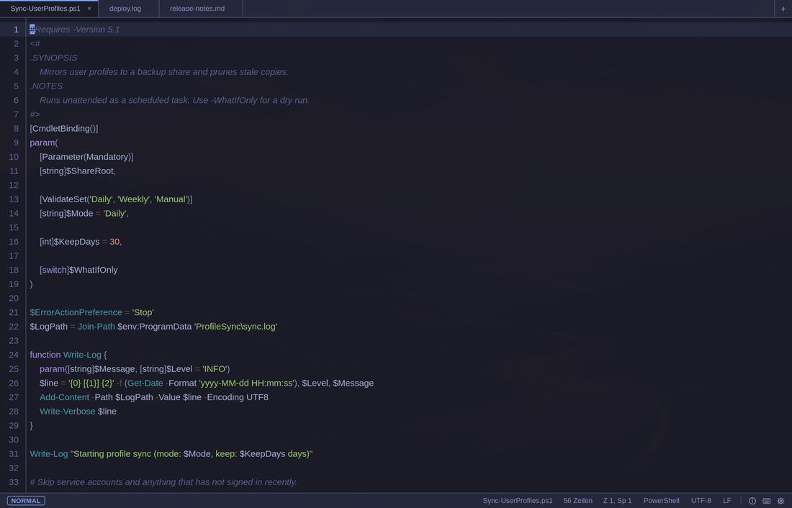

<div align="center">


# Rui

**A focused text editor for Windows and Linux**, with optional Vim keybindings
and a built-in way to learn them.

[](https://github.com/jli-software/Rui/releases)
[](https://github.com/jli-software/Rui/actions/workflows/release.yml)
[](LICENSE)
[](https://github.com/jli-software/Rui/releases)

</div>


Rui is deliberately another text editor. It does not try to replace an IDE or
win a feature checklist. Its job is smaller: open plain-text files quickly,
edit them reliably, and feel the same on Windows and Linux.

I built Rui because I wanted one focused editor on both platforms. Windows
Notepad is too limited for the way I work, while a full IDE is often more than
I need. I also wanted a practical way to use and learn Vim-style editing
without making Neovim itself my everyday Windows editor.

That scope is intentional: no debugger, no LSP, no completion and no terminal.
Rui is a compact place for notes, snippets, scripts, logs and files you want to
inspect before they go anywhere else.

## Install

**Linux** — one line, no repository, no root:

```bash
curl -fsSL https://raw.githubusercontent.com/jli-software/Rui/main/install.sh | bash
```

Installs into your home directory and adds `rui file.txt` to your terminal.
Remove again with `~/.local/share/rui/install.sh --uninstall`.

**Windows** — from [Releases](https://github.com/jli-software/Rui/releases):

| File | What it is |
|---|---|
| `rui-setup.exe` | NSIS installer (per-user) |
| `rui.exe` | portable, runs without installing |
| `rui-setup.msi` | MSI, for Intune/GPO |

Not code-signed, so SmartScreen warns on first launch (*More info* → *Run
anyway*). macOS is untested.

## Focused by design

- Syntax highlighting for 16 languages, loaded on demand
- Find & replace, go to line, undo/redo, folding, line numbers
- Command palette (`Ctrl+Shift+P`) instead of a menu bar
- System clipboard shortcuts, word wrap toggle (`Alt+Z`)
- Clickable status bar — file name, position, language, encoding


- **Tabs**, each keeping its own cursor, folds and undo history
- **Rename in the tab** — `F2` or double click the name
- **Quick Open** (`Ctrl+O`) — fuzzy search across your folders
- Saves only when told to — `Ctrl+S` or `:w`, autosave is opt-in


Every question Rui asks happens inside the window, in Rui's own colours —
never a system dialog landing somewhere else.

## Vim as an option — and a learning path

Vim mode is off by default. Turn it on when you want it; the normal Rui
shortcuts keep working alongside it. `Ctrl+K` opens a searchable shortcut
sheet grouped by modes, movement, editing, search, clipboard and commands, so
the keybindings are available while you learn them instead of living in a
separate manual.


Normal, insert, visual and replace mode are supported, with the current mode
shown in the status bar. `:w`, `:wq`, `:tabnew`, `:set number` and friends go
through Rui's own save and open paths, so encoding survives them. The same
setup works on Windows and Linux.

## At home on Omarchy

On [Omarchy](https://omarchy.org), Rui derives its colours from the active
theme and follows a theme change while it is running — no restart, no
second configuration to keep in sync.



Outside Omarchy, Rui's Sage palette follows the system in light and dark mode.


## Keyboard

| Shortcut | Action |
|---|---|
| `Ctrl+Shift+P` | Command palette |
| `Ctrl+O` | Quick Open |
| `Ctrl+N` / `Ctrl+S` / `Ctrl+Shift+S` | New / Save / Save as |
| `F2` | Rename the file |
| `Ctrl+F` / `Ctrl+G` | Find and replace / Go to line |
| `Ctrl+Shift+C` / `Ctrl+Shift+A` / `Ctrl+Shift+V` | Copy selection / Copy whole file / Paste |
| `Alt+Z` | Word wrap on or off |
| `Ctrl+T` / `Ctrl+W` / `Ctrl+Tab` | New tab / Close tab / Next tab |
| `Ctrl+K` | Keyboard shortcuts |
| `Ctrl+I` | Settings |

With Vim keybindings on, everything Vim binds works in the text area
alongside Rui's own `Ctrl` shortcuts — `Ctrl+K` shows the full list.

## Build

```bash
npm ci
npm run tauri dev              # run it
cd src-tauri && cargo test     # tests
```

Build through the Tauri CLI, not `cargo build --release` — a plain Cargo
build loads the dev server instead of the bundled frontend.

Stack: [Tauri 2](https://tauri.app) + [CodeMirror 6](https://codemirror.net)
+ Rust for file I/O, encoding and window behaviour.

## Licence

MIT — see [LICENSE](LICENSE).
