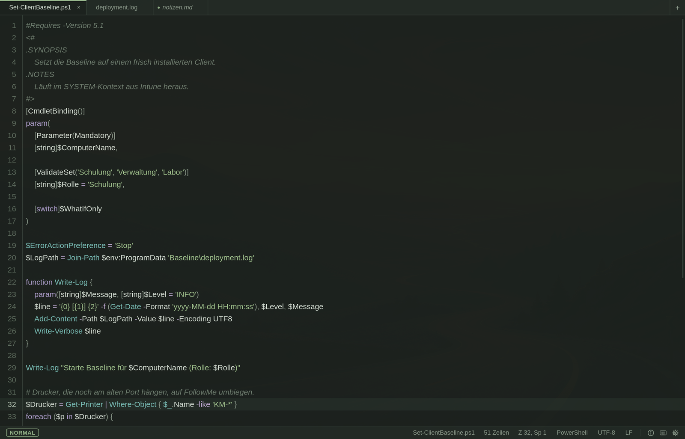
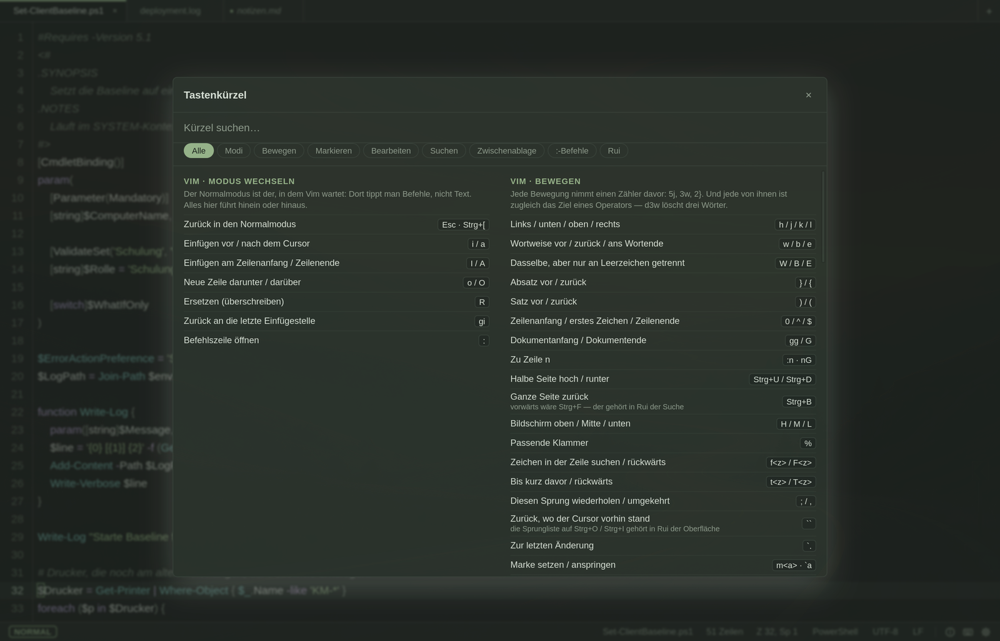
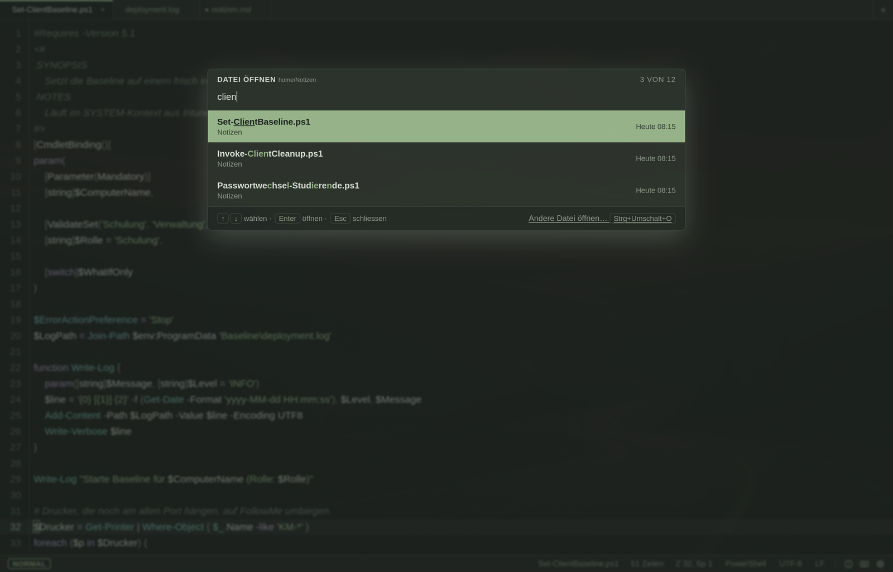
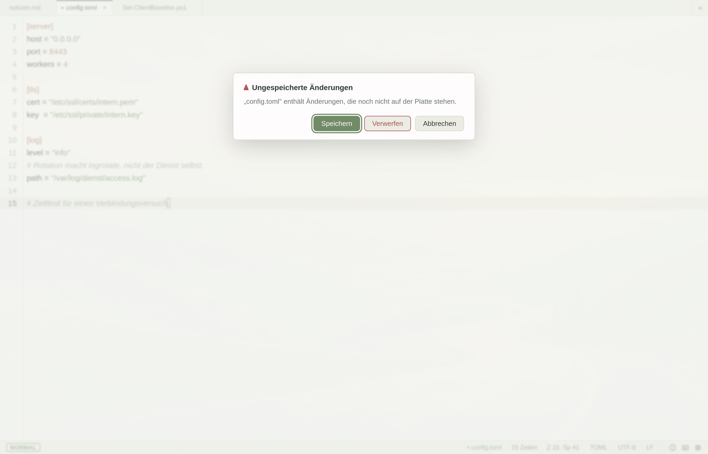
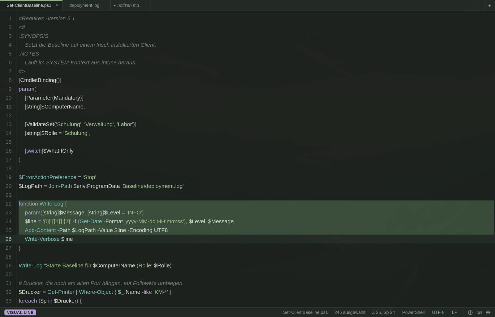
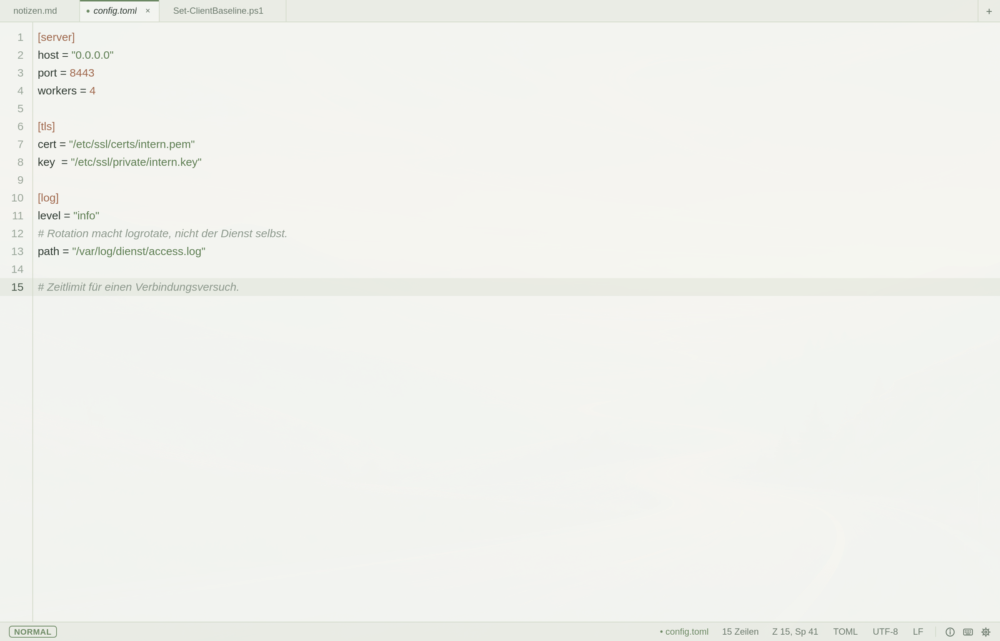

<div align="center">


# Rui

**A small, fast text editor for Windows and Linux** — the kind of thing
Notepad++ was, with Vim keybindings you can switch on or leave off.

[](https://github.com/vikingjunior12/Rui/releases)
[](https://github.com/vikingjunior12/Rui/actions/workflows/release.yml)
[](LICENSE)
[](https://github.com/vikingjunior12/Rui/releases)

</div>



Built because Windows Notepad stopped being enough and there is not much
between it and a full IDE. Rui opens a `.ps1`, a log or a diff instantly,
shows it properly coloured, and lets you edit it without loading a project,
an extension host or a language server. If you work with an AI agent and want
to actually read the snippets it produces before they go anywhere — that is
the case this was built for.

> **Note on language:** the user interface is German only.

## Install

**Linux** — one line, no repository, no root:

```bash
curl -fsSL https://raw.githubusercontent.com/vikingjunior12/Rui/main/install.sh | bash
```

Fetches the latest release and puts the binary in `~/.local/share/rui`, a
symlink in `~/.local/bin` so `rui file.txt` works in any terminal, icons in
`~/.local/share/icons`, and a `rui.desktop` entry so Rui appears in the
application launcher and under *Open with*. Everything stays inside your home
directory. To remove it again: `~/.local/share/rui/install.sh --uninstall`.

Rui does not make itself the default editor — that stays your call:

```bash
xdg-mime default rui.desktop text/plain
```

**Windows** — from [Releases](https://github.com/vikingjunior12/Rui/releases):

| File | What it is |
|---|---|
| `rui-setup.exe` | NSIS installer (per-user) |
| `rui.exe` | portable, runs without installing |
| `rui-setup.msi` | MSI, for Intune/GPO |
| `rui-linux-x86_64.tar.gz` | Linux build, what the line above downloads |
| `SHA256SUMS.txt` | checksums |

Not code-signed, so SmartScreen warns on first launch (*More info* → *Run
anyway*). macOS is untested.

Every release is built by GitHub Actions on both platforms from the tagged
commit — see [`.github/workflows/release.yml`](.github/workflows/release.yml).

## What's in it

### Editing

- Syntax highlighting for 16 languages, each loaded on demand: PowerShell,
  shell, Rust, C#, Go, Python, JS/TS, JSON, YAML, TOML, SQL, XML, INI,
  Markdown, diff, plain text. PowerShell cmdlets are recognised by their
  `Verb-Noun` shape, so `Get-MgUser` and `Get-ADUser` colour like
  `Get-ChildItem`
- Find and replace, go to line, undo/redo, bracket matching, auto-indent,
  code folding, line numbers (absolute or relative)
- Command palette on `Ctrl+Shift+P` instead of a menu bar
- `Ctrl+Shift+C` copies the selection, `Ctrl+Shift+A` the whole file,
  `Ctrl+Shift+V` pastes — all through the system clipboard, no Vim needed
- `Alt+Z` toggles word wrap, for the difference between writing a note and
  reading someone else's log
- Status bar you can click: file name, position, language, encoding, line
  ending. Click the name to copy the full path
- **About Rui** behind the info icon: version, developer, licence, and one
  button that copies the version block a bug report starts with

### The shortcut sheet



`Ctrl+K` — searchable, and split into category tabs: modes, motions,
selection, editing, search, clipboard, the `:` commands, and Rui's own keys.
The tab you pick stays put while you type, so a category and a search term
combine; a line under the list says how many matches are sitting in the other
categories and switches to all of them with one click. `Tab` cycles the
categories from the keyboard.

With Vim mode on, the Vim commands come first — including the ones that Rui's
own shortcuts shadow, spelled out where you would otherwise reach for them
and miss.

### Files



- **Tabs.** Several files open at once, `Ctrl+T` for a new one, `Ctrl+W` to
  close, `Ctrl+Tab` to cycle, `Ctrl+1`–`Ctrl+9` to jump, middle click to
  close. Each tab keeps its full editor state — cursor, selection, folds and
  undo history — so switching back means carrying on, not reopening. The bar
  stays hidden while a single file is open
- **Rename in the tab.** Double click the name, or `F2` — the file is renamed
  on disk, in the same folder, and the syntax highlighting follows the new
  extension. An unnamed buffer gets its name and its place in one go
- **A dot before the name** marks a tab with unsaved changes, in the tab bar
  and in the status bar
- **Saves only when told to.** `Ctrl+S`, or `:w`. Autosave exists as a
  setting and is off by default — opening a config file to read it must never
  change it
- Detects BOM and encoding on open, keeps the line ending, restores both on
  save. A Windows-1252 file with CRLF stays that way
- Crash-safe writes: temp file plus rename
- **Quick Open** on `Ctrl+O` — fuzzy search across your notes folder, any
  extra folders you configure, and the folder of the open file. Newest first,
  build output skipped
- Warns when another program changes the open file; restores every open tab
  after a restart, unsaved buffers included
- `rui a.ps1 b.ps1`, a multiple selection in the file dialog and a drag and
  drop of several files all open one tab each. A file that is already open
  is not opened twice — Rui goes to its tab



Every question Rui asks is asked inside the window, in Rui's own colours —
not by a system dialog that lands somewhere else on a tiling compositor. And
the question about unsaved work has three answers, because that is how many
it has: save, discard, or don't close after all.

### Vim keybindings



Off by default, switched on in the settings, and loaded only if you use them.
Normal, insert, visual and replace mode, with the current one and any pending
input (`2d`) in the status bar. Normal mode reads as an outlined badge and
every other mode as a filled one, so the mode is legible even where a theme
happens to give two of them the same hue.

`:w`, `:w <name>`, `:wq`, `:x`, `:saveas`, `:e`, `:e!`, `:q`, `:q!` and `:qa`
go through Rui's own save and open, so encoding and line endings survive them.
Tabs answer to `:tabnew [file]`, `:tabe`, `:tabn`, `:tabp` and `:tabc`, as
well as `:bn`, `:bp` and `:bd` — one tab holds exactly one buffer here, so
both families mean the same thing. `:q` closes the tab and only the last one
closes the window, the way Vim does it.

`:set wrap`, `:set number` and `:set relativenumber` — with the `no…`, `…!`
and `…?` forms and the short names `nu` and `rnu` — write straight into Rui's
settings, so what you switch there is still switched after a restart and is
the same switch the settings dialog shows. Everything else `:set` knows stays
with the Vim package.

A write reports back in the status bar the way Vim reports in its command
line — which is where a buffer that got its name on save tells you that name.
`"+y` and `"+p` reach the system clipboard, as does `Ctrl+Shift+C` /
`Ctrl+Shift+V`.

### System integration

One section in the settings hooks Rui into the system and unhooks it again.
Nothing is written system-wide — it all lives under your user profile, no
administrator or root rights.

- **Windows** — puts the folder of the running `rui.exe` on the user `PATH`
  so `rui file.ps1` works from any terminal. The installer registers text,
  log, script and source file types so Rui shows up under *Open with*; a
  button leads to the page where you pick the default
- **Linux** — symlinks the binary into `~/.local/bin` for the same thing,
  and writes a `.desktop` entry so Rui appears in the file manager's *Open
  with*. Neither makes Rui the default; that stays your call

### Looks



Sage palette in light and dark, following the system by default. On Linux it
picks up the active [Omarchy](https://omarchy.org) theme — syntax colours as
the theme means them, interface colours checked against the surface they land
on, because a terminal palette says what a theme calls "green" and nothing
about whether two of its colours stay readable side by side. Window decoration
is automatic: own title bar on Windows, none under a tiling compositor.

## Keyboard

| Shortcut | Action |
|---|---|
| `Ctrl+Shift+P` | Command palette |
| `Ctrl+O` | Quick Open |
| `Ctrl+Shift+O` | Open via system dialog |
| `Ctrl+N` / `Ctrl+S` / `Ctrl+Shift+S` | New / Save / Save as |
| `F2` | Rename the file |
| `Ctrl+F` / `Ctrl+G` | Find and replace / Go to line |
| `Ctrl+Shift+C` / `Ctrl+Shift+A` / `Ctrl+Shift+V` | Copy selection / Copy whole file / Paste |
| `Alt+Z` | Word wrap on or off |
| `Ctrl+T` / `Ctrl+W` / `Ctrl+Tab` | New tab / Close tab / Next tab |
| `Ctrl+K` | Keyboard shortcuts |
| `Ctrl+I` | Settings |
| `Ctrl++` / `Ctrl+-` / `Ctrl+0` | Font size |

With Vim keybindings on, everything Vim binds works in the text area and
Rui's own `Ctrl` shortcuts keep working alongside it. `Ctrl+K` shows the full
list — the Vim commands first while Vim mode is on, and a note on every Rui
shortcut that shadows a NeoVim binding.

## Not in it

No debugger, no build integration, no LSP, no completion, no terminal. The
interface is German only.

## Build

```bash
npm install
npm run tauri dev              # run it
cd src-tauri && cargo test     # tests

.\scripts\build-release.ps1    # Windows: release/rui.exe + installers
./scripts/build-release.sh     # Linux:   release/rui-linux
```

Build through the Tauri CLI, not `cargo build --release`. The Cargo feature
`custom-protocol` — which only the CLI sets — decides whether the app serves
its frontend from the embedded `dist/` or from the dev server on
`localhost:1420`. A binary built without it starts on an error page.

### Install your own build on Linux

```bash
./scripts/install-linux.sh              # build if needed, then install
./scripts/install-linux.sh --uninstall  # remove it again
./scripts/package-linux.sh              # release/rui-linux-x86_64.tar.gz
```

The first one builds and then hands over to the same `install.sh` the one-line
install uses, so a build from source lands in exactly the same places. The same
registration is also available from Rui's settings under *Linux*, for when you
run the binary from wherever you downloaded it.

Windows is built natively, not cross-compiled — WebView2 and the MSVC linker
make that unreliable from the outside. Needs the MSVC build tools, the
`x86_64-pc-windows-msvc` target and Node. For releases that is CI's job; the
Linux job runs on Ubuntu 22.04 so the binary does not demand a newer glibc
than the distribution it lands on.

Settings live in `%APPDATA%/ch.gaiching.rui/settings.json`; defaults are in
`settings.rs`, not in the file. The settings dialog has a button that opens
it.

Stack: [Tauri 2](https://tauri.app) + [CodeMirror 6](https://codemirror.net)
+ Rust for file I/O, encoding and window behaviour. Code comments, commit
messages and `CHANGELOG.md` are in German.

## Licence

MIT — see [LICENSE](LICENSE).
